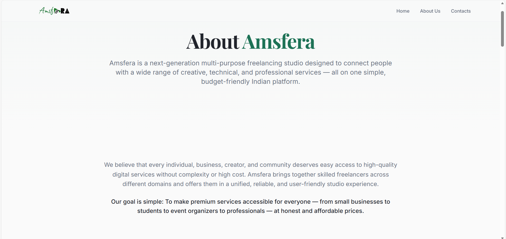

# AMSfera Website
This repository contains the source code for AMSfera's official website.

## Features
- Service catalog
- Client contact form
- Portfolio showcase

## Tech Stack
- HTML/CSS/JavaScript
- PostgreSQL (for backend data)
- Power BI integration (for dashboards)

## How to Run
1. Clone the repo
2. Open index.html in browser

## AMSfera Website Screenshots

### Homepage

### About Amsfera Studio

